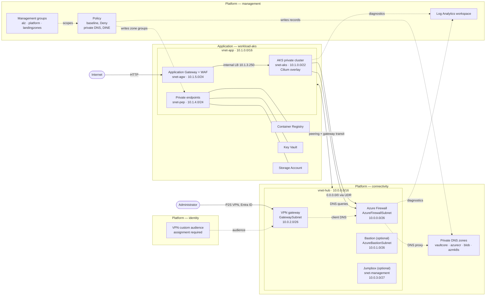

# Azure Landing Zones with Terraform and AVM

A CAF hub and spoke platform: three platform landing zones that own governance, identity
and connectivity, and an application landing zone that owns a workload. Four Terraform
roots, four states, four subscriptions, one per team boundary.

Azure resources come from [Azure Verified Modules](https://azure.github.io/Azure-Verified-Modules/)
wherever one exists. What is hand-written is what no module covers: the management group
hierarchy, the policy definitions and assignments, and a few role assignments.

## Architecture



| Landing zone | Owns |
|---|---|
| `platform/management` | Management group hierarchy, a deny-only policy baseline, the ALZ private DNS initiative, the shared Log Analytics workspace |
| `platform/identity` | Entra ID objects. No `azurerm` provider: a directory object has no subscription |
| `platform/connectivity` | Hub network, Azure Firewall with DNS proxy, private DNS zones, point-to-site VPN, optional Bastion and jumpbox |
| `application/workload-aks` | Private AKS cluster, Container Registry, Key Vault, storage, Application Gateway with WAF, managed identities |

- The spoke has no public egress. `0.0.0.0/0` goes to the firewall and the cluster runs
  with `outbound_type = userDefinedRouting`. Inbound arrives only at the Application
  Gateway, behind a WAF in Prevention mode.
- The spoke's DNS server is the firewall, whose proxy forwards to Azure DNS. Private
  endpoints resolve from the spoke without linking a single zone to it.
- Resolving a private endpoint name is not access to it. Reaching one is decided by the
  NSG on `snet-pep` and the firewall, reading anything by Azure RBAC.

## Deploy

Terraform >= 1.11 and an authenticated Azure CLI. Replace the four placeholder
subscription IDs first: the `subscriptions` map in
`landing-zones/platform/management/locals.tf`, repeated in the roots that need them.

| Placeholder | Subscription | Also named in |
|---|---|---|
| `11111111-…` | management | bootstrap, connectivity, workload-aks |
| `22222222-…` | identity | — |
| `33333333-…` | connectivity | workload-aks |
| `44444444-…` | workload-aks | — |

```bash
az login

# State storage and a backend.hcl per landing zone. This root has no backend of its
# own: it creates the account the others store their state in.
terraform -chdir=bootstrap init && terraform -chdir=bootstrap apply

for lz in platform/management platform/identity platform/connectivity application/workload-aks; do
  terraform -chdir=landing-zones/$lz init -backend-config=backend.hcl
done
```

Apply in order, copying the values each root prints into the next:

1. `platform/management` — needs Owner on the tenant root group and on each subscription.
   Copy `private_dns_policy_principal_id` into connectivity's `platform` block.
2. `platform/identity` — set `vpn_user_group_object_ids`, copy `vpn_audience_client_id`
   into connectivity's `identity` block. Skip it and a `check` block warns the gateway is
   open to the whole tenant.
3. `platform/connectivity`.
4. `application/workload-aks` — set `aks_admin_group_object_ids`, or the cluster has no
   administrators, since local accounts are disabled.

Tear down in reverse order.

## Cost

Retail pay-as-you-go for West Europe in EUR, from the
[Azure Retail Prices API](https://learn.microsoft.com/rest/api/cost-management/retail-prices/azure-retail-prices)
on 2026-09-10, at 730 hours per month. An order of magnitude, not a quote.

| Component | EUR / month |
|---|---:|
| Azure Firewall Standard | 784 |
| AKS nodes, 4 × Standard_D4ds_v5 | 682 |
| Application Gateway WAF_v2, 2 instances | 474 |
| VPN gateway VpnGw1AZ and one connection | 138 |
| AKS Standard tier | 63 |
| Container Registry Premium | 44 |
| Log Analytics, private endpoints, DNS, public IPs, storage | ~88 |
| **Default deployment** | **~2 273** |
| Plus Bastion and jumpbox | 2 430 |
| Plus Defender for Containers | 2 525 |

Management groups, policy assignments and the app registration are free. The firewall is
81 percent of the hub and buys one thing: a single controlled egress path with logging.
ACR is Premium because private endpoints require it.

Biggest levers: `deploy_vpn = false` saves 141, one node per pool saves 341,
`min_capacity = 1` on the gateway saves 91, and `terraform destroy` between demos saves
all of it, since the firewall bills per deployment hour.

## Repository layout

```
bootstrap/                     state storage account and backend.hcl per landing zone
landing-zones/
├── platform/
│   ├── management/            governance: management groups, policy, Log Analytics
│   ├── identity/              tenant: Entra ID application registrations
│   └── connectivity/          hub: network, firewall, DNS, VPN, bastion
└── application/
    └── workload-aks/          spoke: AKS, ACR, Key Vault, storage, identities
modules/
└── app-registration/          Entra ID application registration
```

Every root keeps the same file names: `locals.tf` is the whole configuration, with no
variables and no `.tfvars`; `platform.tf` is what the root consumes from
`platform/management`; `terraform.tf` pins versions. Provider lock files are committed for
`linux_amd64`, `darwin_arm64` and `windows_amd64`.

CI runs `fmt`, `init`, `validate` and `tflint` against every root plus a Trivy scan, none
of it needing Azure credentials. The same checks run locally through pre-commit.

## Known gaps

A reference architecture, not a production platform. The network design, identity model
and data-plane isolation are production-grade; the operating model around them is not.

- **Governance is a demonstration.** Six deny policies where a real tenant runs hundreds
  through the ALZ archetypes. No subscription vending, no exemptions, no remediation task.
- **No pipeline.** State has a real backend, but no OIDC deployment pipeline, no plan
  review gate, no drift detection, and no per-container state RBAC.
- **One environment, hardcoded.** Adding staging means copying a directory.
- **Platform defaults.** Microsoft-managed keys, no backup, no second region, no alert
  rules, HTTP-only ingress, and no tests beyond CI proving the configuration parses.

Deliberately out of scope: ExpressRoute and site-to-site VPN, DNS Private Resolver, DDoS
Network Protection, customer-managed keys, backup and multi-region recovery.
